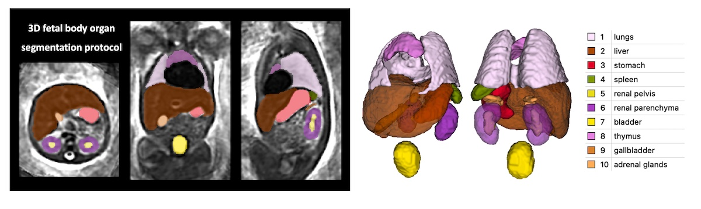

Automated organ segmentation for 3D T2w fetal body MRI
====================

This repository contains [MONAI](https://github.com/Project-MONAI/MONAI)-based scripts for automated segmentation of body organs in 3D [DSVR](https://www.ncbi.nlm.nih.gov/pmc/articles/PMC7116020/)-reconstructed images of T2w fetal body MRI. The segmentation protocol includes 10 organ ROIs relevant to volumetry studies. An example of parcellation labels is publicly availalbe in [KCL CDB fetal body atlas repository](https://gin.g-node.org/kcl_cdb/fetal_body_mri_atlas). 

The scripts used installed in the corresponding [Fetal SVRTK docker](https://hub.docker.com/r/fetalsvrtk/segmentation) containers together with network weights and [SVRTK](https://github.com/SVRTK/SVRTK) software.  

License
-------

The 3D Fetal MRI package and all scripts are distributed under the terms of the
[Apache License Version 2](http://www.apache.org/licenses/LICENSE-2.0). The license enables usage of SVRTK in both commercial and non-commercial applications, without restrictions on the licensing applied to the combined work.

Citation and acknowledgements
-----------------------------

In case you found this  useful please give appropriate credit to the software ([SVRTK dockers](https://hub.docker.com/r/fetalsvrtk/)).

> Uus, A. U., Hall, M., Grigorescu, I., Avena Zampieri, C., Egloff Collado, A., Payette, K., Matthew, J., Kyriakopoulou, V., Hajnal, J. V., Hutter, J., Rutherford, M. A., Deprez, M., Story, L. (2023) Automated body organ segmentation and volumetry for 3D motion-corrected T2-weighted fetal body MRI: a pilot pipeline. medRxiv 2023.05.31.23290751; doi: https://doi.org/10.1101/2023.05.31.23290751

Disclaimer
-------

This software has been developed for research purposes only, and hence should not be used as a diagnostic tool. In no event shall the authors or distributors be liable to any direct, indirect, special, incidental, or consequential damages arising of the use of this software, its documentation, or any derivatives thereof, even if the authors have been advised of the possibility of such damage.

